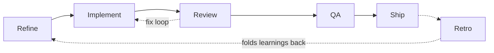

# AI Software Factory

A self-contained, agent-driven software pipeline built on [Claude Code](https://www.anthropic.com/claude-code). Work flows from a rough idea to a shipped, reviewed, QA'd change through a repeatable loop run by a team of AI agents — with the human acting as orchestrator-of-last-resort and the only one allowed to ship.

The pipeline builds a real application as its testbed: a personal expense tracker that imports bank statements and summarizes spending. The app is deliberately simple since the focus is on how to build software with an AI factory.

---

## Why this exists

I wanted to find out how far a structured, multi-agent workflow could take a project on its own: not with a single prompt, but with a genuine development process — backlog, branches, pull requests, code review, QA, and retrospectives — with each stage owned by an agent and the rules captured in version control rather than in someone's head.

---

## The factory

Every unit of work is a **story**. Each story moves through a fixed lifecycle, and each stage maps to a slash command or agent:



| Stage | Command | What happens |
| --- | --- | --- |
| **Refine** | `/refine` | Turns a rough idea into a story with clear acceptance criteria, committed to the backlog. |
| **Implement** | implementer subagent | Works one story per branch (`story/<slug>`) in an isolated git worktree and opens a pull request. Never implemented in the main thread. |
| **Review** | `/review` | Reviews the PR against its acceptance criteria and posts review comments on GitHub. |
| **QA** | `/qa` | Verifies the running behavior against the acceptance criteria; on failure, appends a QA section for the implementer to fix. |
| **Ship** | `/ship` | Human-gated. Refuses unless the story is under review, QA is clean, and PR checks are green. |

Two design choices do most of the work:

- **The orchestrator is the single point of contact.** The human talks to one agent, which routes requests and drives the commands and subagents as tools. A new idea triggers `/refine`; a finished PR auto-triggers `/review`.
- **Review and fixing are an automatic loop.** Once `/review` posts comments, the implementer is sent back to address them on the same PR, then it re-reviews — repeating until no comments remain — before returning to the human. No back-and-forth prompting between rounds.

After every story in an epic is done, `/retro` folds what the agents learned back into the guidelines, commands, and agents, so the pipeline improves over time instead of repeating mistakes.

## Principles

- **The repo is the only memory.** Standards, conventions, and learnings live in `.claude/guidelines/` and the backlog — never in agent home-folder memory — so the whole process is reproducible, reviewable, and survives a fresh checkout.
- **One story = one branch = one PR.** Changes stay scoped; unrelated cleanups become their own stories.
- **The backlog is the source of truth.** Story status (`new → ready → in-progress → under-review → done`) is tracked in the repo under `backlog/` and committed to `main`, so progress is browseable and linkable on GitHub — while staying out of code PR diffs.
- **The human owns the merge.** Only `/ship` merges or marks a story done, and only when the gates pass.
- **Sensitive data stays out.** Real bank statements are gitignored; only synthetic fixtures under `testdata/` ever enter the repo.

---

## The application (testbed)

A personal expense tracker that imports bank statements and summarizes spending.

**Stack**

- **Backend:** Go (standard-library HTTP)
- **Database:** PostgreSQL 17
- **Frontend:** Vue 3 + Vite (plain Vue with scoped CSS, no component framework)
- **Dev environment:** Devcontainer (Go + Postgres via Docker Compose)

## Running locally

The project runs inside the devcontainer.

```bash
go run .
```

- App listens on `:8080` (`/healthz` returns `ok`).
- Postgres is reachable at `db:5432`; the connection string is in `DATABASE_URL`.
- Frontend: `cd frontend && npm run dev` (port 5173).

Use the synthetic `testdata/sample_statement.csv` during development. Real statements live in a gitignored `/data/` directory and are never committed.

---

## Repository layout

```
.claude/        Agents, slash commands, and guidelines (the factory's rules)
backlog/        Epics and stories — the source of truth for what's been done
frontend/       Vue 3 + Vite app
testdata/       Synthetic fixtures safe to commit
CLAUDE.md       Orchestrator instructions, loaded every session
main.go         Go backend entrypoint
```
